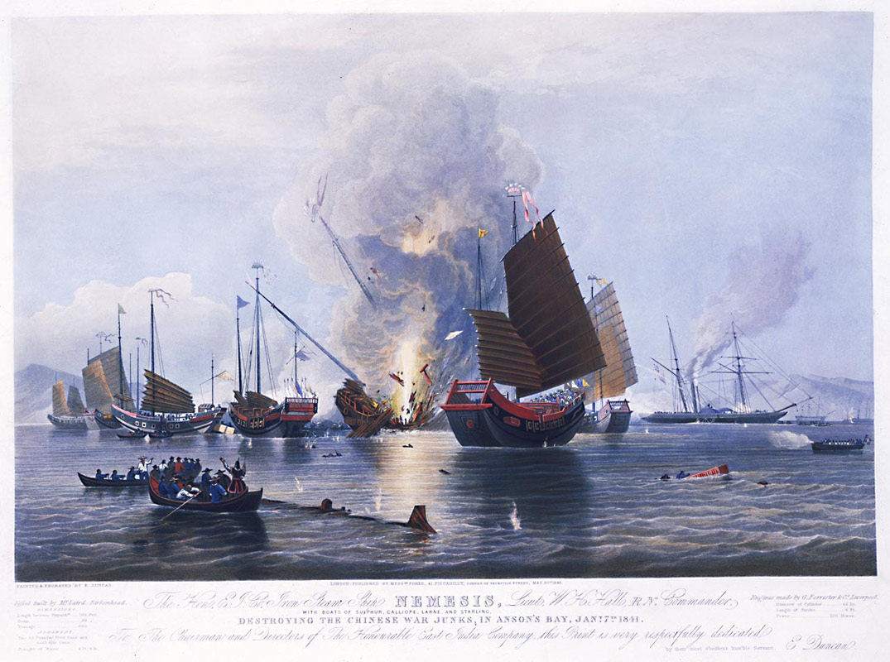

### Keywords

### Points of discussion

### Readings
Note: compulsory readings have been marked in **bold**

* Alexander, Joseph G. 1896. “The Truth about the Opium War.” *The North American Review* 163 (478): 381–83. https://www.jstor.org/stable/25118713.
* Derks, Hans. 2012. “JAPAN.” In History of the Opium Problem, 493–530. *The Assault on the East, ca. 1600 - 1950*. Brill. https://www.jstor.org/stable/10.1163/j.ctv4cbhdf.32.
* Melancon, Glenn. 1999. “Honour in Opium? The British Declaration of War on China, 1839–1840.” *The International History Review* 21 (4): 855–74. https://doi.org/10.1080/07075332.1999.9640880.
* Taylor, Jeremy E. 2002. “The Bund: Littoral Space of Empire in the Treaty Ports of East Asia.” *Social History* 27 (2): 125–42. https://doi.org/10.1080/03071020210128364.
* **Wakabayashi, Bob Tadashi. 1992. “Opium, Expulsion, Sovereignty. China’s Lessons for Bakumatsu Japan.” *Monumenta Nipponica* 47 (1): 1–25. https://doi.org/10.2307/2385356**.

### Primary sources

* Parker, Edward Harper, and Yuan Wei. 1888. *Chinese Account of the Opium War*. Shanghai : Kelly & Walsh, ltd. http://archive.org/details/chineseaccountof00parkrich.

### Audiovisual materials

* [The Opium War in Japanese Eyes: Image Gallery; Illustrations from Kaigai Shinwa and Kaigai Shinwa Shūi](https://ocw.mit.edu/ans7870/21f/21f.027/opium_wars_japan/oje_gallery.html); 

### Links to other projects, websites, others

* **[The Opium War in Japanese Eyes](https://ocw.mit.edu/ans7870/21f/21f.027/opium_wars_japan/index.html)** (essay by John Dower)

### to follow (@twitter)
@Visualizing_Cul
