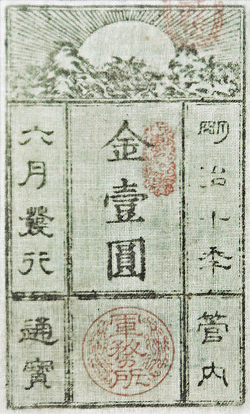

### Keywords

[Japanese currency](https://en.wikipedia.org/wiki/Japanese_currency)

### Points of discussion

* why could the pre-modern monetary system continue for so long? List the conditions for this; who or what was to gain from this set-up?
* why is it important to know that silver and gold were not mere commodities, but the country's currency as well?
* do you see parallels with other past and/or contemporary happenings?

### Readings
(Note: compulsory readings have been marked in **bold**)

* Metzler, Mark. 2006. *Lever of Empire: The International Gold Standard and the Crisis of Liberalism in Prewar Japan*. Twentieth-Century Japan 17. Berkeley: University of California Press. Pp. 14-28.
* McMaster, John. 1960. “The Japanese Gold Rush of 1859.” *The Journal of Asian Studies* 19 (3): 273–87. https://doi.org/10.2307/2943487.
* **Ohkura, Takehiko, and Hiroshi Shimbo. 1978. “The Tokugawa Monetary Policy in the Eighteenth and Nineteenth Centuries.” *Explorations in Economic History* 15 (1): 101–24. https://doi.org/10.1016/0014-4983(78)90040-2.**
* **Sawada Sho. 1936. “Financial Difficulties of The Edo Bakufu.” *Harvard Journal of Asiatic Studies* 1 (3/4): 308–26. https://doi.org/10.2307/2717787.**

### Primary sources

* Griffis, William Elliot. 1895. *Townsend Harris, First American Envoy in Japan*. Boston, New York, Houghton, Mifflin and Company. http://archive.org/details/townsendharrisf00grifgoog.
* **Harris, Townsend. 1959. *Complete Journal of Townsend Harris*. Rutland, Vt.,: C. E. Tuttle co. http://archive.org/details/completejournalo00harr.** (seek references with respect to gold and silver)
* Matsukata, Masayoshi. 1897. *Reasons for the Adoption of a Single Gold Standard by the Empire of Japan* [Microform]. [S.l. : s.n.]. http://archive.org/details/reasonsforadopti00mats.
* **Masayoshi Matsukata. 1899. *Report on the Adoption of the Gold Standard in Japan*. Printed at the Government press. http://archive.org/details/reportonadoptio00matsgoog.** Pp. 1-17.
* Satow, Ernest Mason. 1921. *A Diplomat in Japan; the Inner History of the Criticial Years in the Evolution of Japan When the Ports Were Opened and the Monarchy Restored*. London : Seeley, Service. http://archive.org/details/diplomatinjapani00sato.
* 佐藤雅美. 2003. 『「大君の通貨―幕末「円ドル」戦争』. 東京: 文藝春秋.

### Audiovisual materials

### Links to other projects, websites, others

* Cullen, Louis M. 2009. “Statistics of Tokugawa Coastal Trade and Bakumatsu and Early Meiji Foreign Trade.” *Japan Review*, no. 21: 183–223. https://www.jstor.org/stable/25791334.
* Cullen, Louis M. 2010. “Statistics of Tokugawa Coastal Trade and Bakumatsu and Early Meiji Foreign Trade, Part 2: Trade in Bakumatsu and Early Meiji Times.” *Japan Review*, no. 22: 59–102. https://www.jstor.org/stable/25791342.
* “Apocalypse Now: An Alternate View of the Bakumatsu Years | M. William Steele – Digital Meijis.” n.d. Accessed September 28, 2018. https://pressbooks.bccampus.ca/meijiat150/chapter/apocalypse-now-an-alternate-view-of-the-bakumatsu-years-m-william-steele/.
* 鎮目雅人 [『銀貨の歴史〜激動の時代をささえた貨幣〜』](http://www.waseda.jp/fpse/winpec/assets/uploads/2016/03/84a4f9cdcda7bac5b32b794a9834dd78.pdf) 早稲田大学現代政治経済研究所〈WINPEC Working Paper〉、2016年、1-14頁。 
* 武田晴人 [「「両」制度の崩壊――幕末の金流出」](https://www.boj.or.jp/announcements/koho_nichigin/backnumber/data/nichigin18-7.pdf)、『にちぎん』 (日本銀行)24-27頁、2009年。

### to follow (@twitter)

