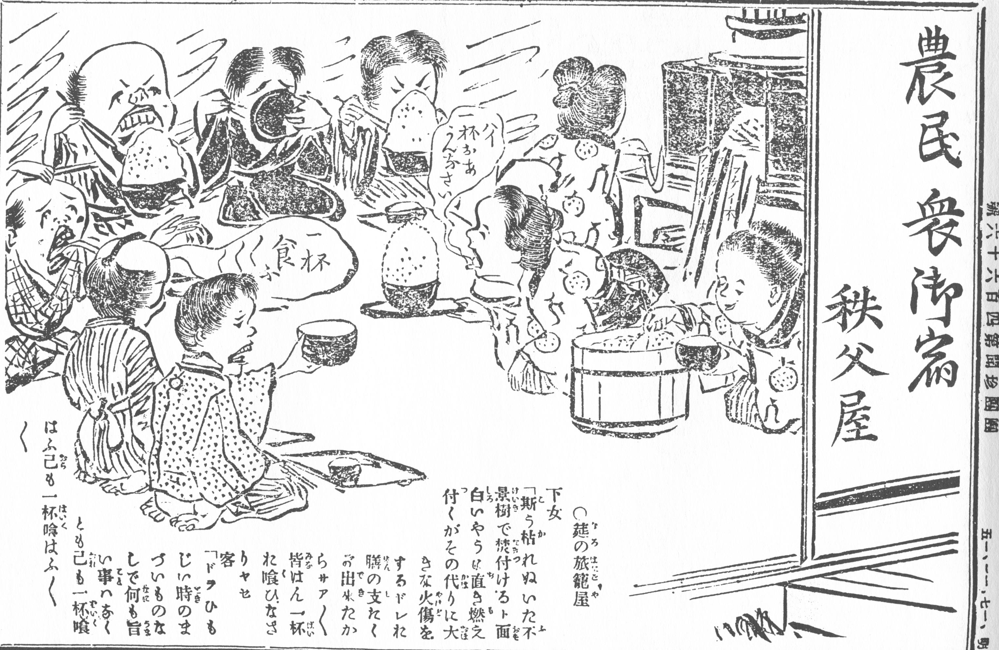

### Keywords

### Points of discussion

### Readings
Note: compulsory readings have been marked in **bold**

* **Ericson, Steven J. 2014. “The ‘Matsukata Deflation’ Reconsidered: Financial Stabilization and Japanese Exports in a Global Depression, 1881–85.” *The Journal of Japanese Studies* 40 (1): 1–28. https://doi.org/10.1353/jjs.2014.0045.**
* **———. 2016. “Orthodox Finance and ‘The Dictates of Practical Expediency’: Influences on Matsukata Masayoshi and the Financial Reform of 1881–1885.” *Monumenta Nipponica* 71 (1): 83–117. https://doi.org/10.1353/mni.2016.0002.**

### Primary sources

### Audiovisual materials

### Links to other projects, websites, others

### to follow (@twitter)

