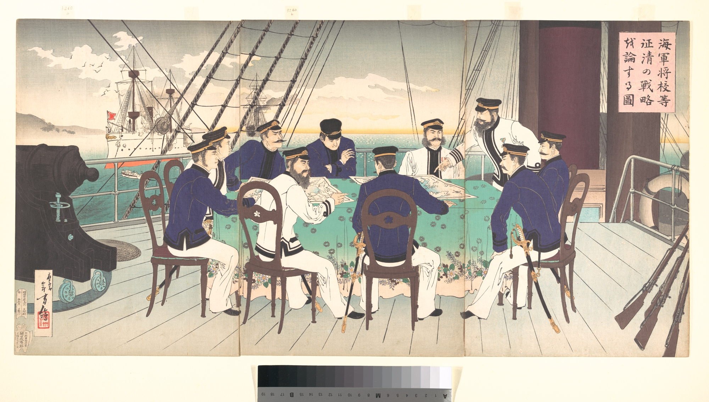

Source: Sino-Japanese War: Picture of Naval Officers Discussing Strategy to Be Used in the War against China. 1894. Triptych of polychrome woodblock prints; ink and color on paper. http://archive.org/details/mma_sinojapanese_war_picture_of_naval_officers_discussing_strategy_to_be_used__55276.

### Keywords

### Points of discussion

### Readings
Note: compulsory readings have been marked in **bold**

* Howland, Douglas. 2007. “Japan’s Civilized War: International Law as Diplomacy in the Sino-Japanese War (1894-1895).” *Journal of the History of International Law* 9: 179–202.
* Howland, Douglas. 2015. “The Japan House Tax Case, 1899-1905: Leases in Perpetuity and the Myth of International Equality.” *Zeitschrift Für Ausländisches öffentliches Recht Und Völkerrecht* 75 (2): 413–34. http://www.zaoerv.de/75_2015/75_2015_2_a_413_434.pdf.

### Primary sources

### Audiovisual materials

* 1990PatMorrison. n.d. Naval Battle From the First Sino-Japanese War. Accessed September 19, 2018. https://www.youtube.com/watch?v=og5svzyrvag.

### Links to other projects, websites, others

### to follow (@twitter)

