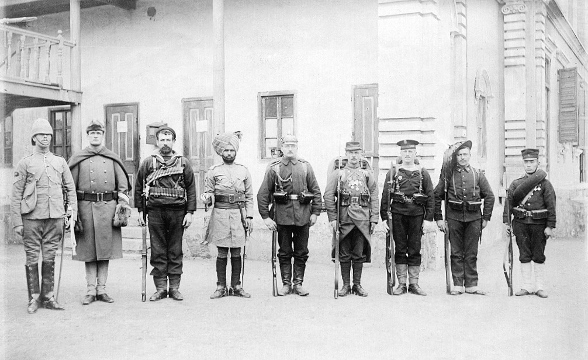

### Keywords

* `imperialism`, `extraterritoriality`, `carving up of china`

### Points of discussion

* the Boxer rebellion was a clear example of the mobilization of international public opinion. Discuss.
* Was the true battleground of the Rebellion not in the first place 'international law'? What does this mean for our understanding of international law and values in the context of imperialism? Relate your thoughts to notions as political power and legitimacy.

### Readings
Note: compulsory readings have been marked in **bold**

* Ouellet, Eric. 2009. “Multinational Counterinsurgency: The Western Intervention in the Boxer Rebellion 1900–1901.” *Small Wars & Insurgencies* 20 (3–4): 507–27. https://doi.org/10.1080/09592310903027074.
* **Perdue, Peter C., and Ellen Sebring. n.d. “MIT Visualizing Cultures: The Boxer Uprising I - The Gathering Storm in North-China (1860-1900).” Accessed November 11, 2018. https://ocw.mit.edu/ans7870/21f/21f.027/boxer_uprising/bx_essay01.html.**
* **Perdue, Peter C., and Ellen Sebring. n.d. “MIT Visualizing Cultures: The Boxer Uprising II - War and Aftermath.” Accessed November 11, 2018. https://ocw.mit.edu/ans7870/21f/21f.027/boxer_uprising_02/index.html.**
* **Perdue, Peter C., and Ellen Sebring. n.d. “MIT Visualizing Cultures: The Boxer Uprising III** (forthcoming)
* **Valliant, Robert B. 1974. “The Selling of Japan. Japanese Manipulation of Western Opinion, 1900-1905.” *Monumenta Nipponica* 29 (4): 415–38. https://doi.org/10.2307/2383894.**

### Primary sources

* s.n. *The Boxer Rising : A History of the Boxer Trouble in China*. 1901. [Shanghai]. http://archive.org/details/boxerrisinghisto00shanuoft.
* Clements, Paul Henry. 1915. *The Boxer Rebellion; a Political and Diplomatic Review*. New York : Columbia University. http://archive.org/details/boxerrebellionpo00clemrich.
* Cyrill Method. 1900. *Revoluce v Číně*. http://archive.org/details/revoluce_v_cine.
* Robert Coltman. n.d. *Beleaguered in Pekin: The Boxer’s War Against the Foreigner*. Project Gutenberg. Accessed November 11, 2018. http://archive.org/details/beleagueredinpek49577gut.
* Scheibert, Justus. 1901. *Krieg in China*. Berlin: A. Schröder. http://archive.org/details/KriegInChina_405.
* Voyron, Émile Jean François Régis. 1904. *Rapport sur l’expédition de Chine, 1900-1901*. Paris : H. Charles-Lavauzelle. http://archive.org/details/gri_33125010786933.

### Audiovisual materials

* [In Search Of History - China’s Boxer Rebellion](https://www.youtube.com/watch?v=U_QXW1VMPQ0) (History Channel Documentary). n.d. Accessed April 25, 2020. .
* **Peter Perdue and Ellen Sebring, [Boxer Rebellion Overview](https://techtv.mit.edu/videos/6805d177e4394255a42ab2508f132861/)**
* Tilman, Remme. 2014. Boxer Rebellion. https://vimeo.com/94828509.

### Links to other projects, websites, others

* **Perdue, Peter; Sebring, Ellen. [The Boxer Rebellion](https://ocw.mit.edu/ans7870/21f/21f.027/boxer_uprising/pdf/bx_essay01.pdf)**

### to follow (@twitter)
@Visualizing_Cul

