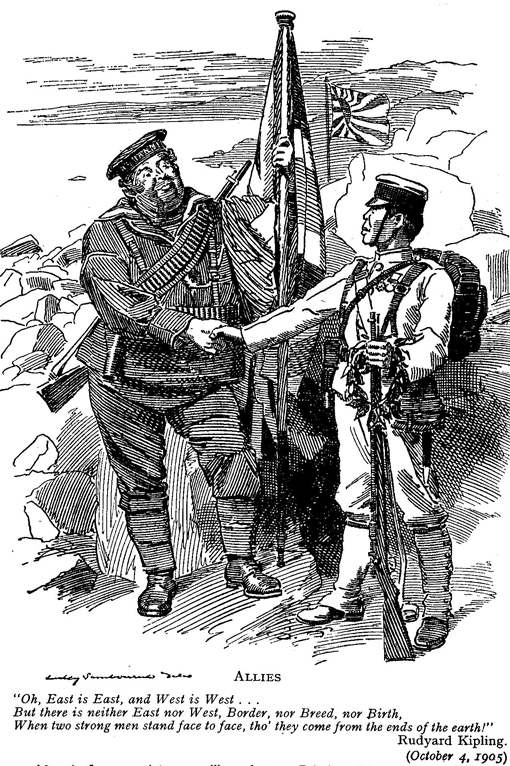

A scan of a cartoon from The New Punch Library volume 1, page 44, published in London in 1932. First published on 4 October 1905.
Source: Wikipedia.

### Keywords

* `imperialism`, [`security dilemma`](https://en.wikipedia.org/wiki/Security_dilemma), [`Thucydides trap`](https://foreignpolicy.com/2017/06/09/the-thucydides-trap/)

### Points of discussion

### Readings
Note: compulsory readings have been marked in **bold**

* **Best, Antony. 2006. “Race, Monarchy, and the Anglo-Japanese Alliance, 1902–1922.” *Social Science Japan Journal* 9 (2): 171–86. https://doi.org/10.1093/ssjj/jyl027.**
* **Davis, Christina L. 2009. “Linkage Diplomacy: Economic and Security Bargaining in the Anglo-Japanese Alliance, 1902–23.” *International Security* 33 (3): 143–79. https://doi.org/10.1162/isec.2009.33.3.143.**

### Primary sources

* Alfred L.p. Dennis. 1923. *The Anglo-Japanese Alliance*. http://archive.org/details/in.ernet.dli.2015.13130.
* *The Anglo-Japanese Alliance*. 1921. [Tientsin : s.n.] http://archive.org/details/anglojapaneseall00tienuoft.
* Wood, Ge-Zay. [c1921]. *China, the United States, and the Anglo-Japanese Alliance*. New York H. Revell. http://archive.org/details/chinaunitedstate00wooduoft.

### Audiovisual materials

* Guy Fawkes. n.d. *Rise and Fall of the Japanese Empire Part One*. Accessed November 15, 2018. https://www.youtube.com/watch?v=BJFe2nLcmjo&t=28s.

### Links to other projects, websites, others

### to follow (@twitter)

