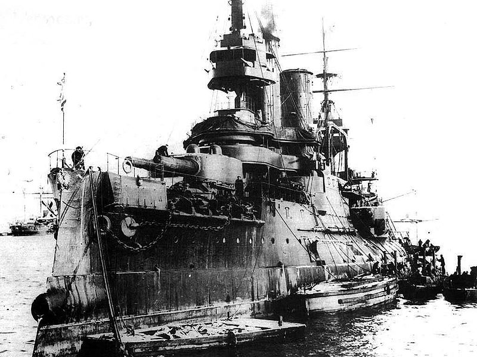
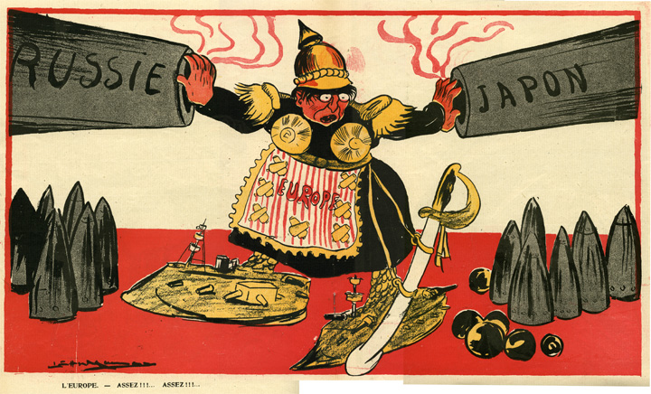

### Keywords

### Points of discussion

### Readings
Note: compulsory readings have been marked in **bold**

* **Gerbig-Fabel, Marco. 2008. “Photographic Artefacts of War 1904–1905: The Russo-Japanese War as Transnational Media Event.” *European Review of History: Revue Européenne d’histoire* 15 (6): 629–42. https://doi.org/10.1080/13507480802500301.**
* **Howland, Douglas. 2011. “Sovereignty and the Laws of War: International Consequences of Japan’s 1905 Victory over Russia.” *Law and History Review* 29 (1): 53–97. https://doi.org/10.1017/S0738248010001227.**
* Steinberg, John, Bruce Menning, David Schimmelpenninck van der Oye, David Wolff, and Shinji Yokote. 2012. *The Russo-Japanese War in Global Perspective: World War Zero*. 1st Edition edition. Leiden ; Boston: BRILL.
* Sweeney, Michael S. 1998. “‘Delays and Vexation’: Jack London and the Russo-Japanese War.” *Journalism & Mass Communication Quarterly* 75 (3): 548–59. https://doi.org/10.1177/107769909807500309.

### Primary sources

* [Jacar 'Topics": The Russo-Japanese War](https://www.jacar.go.jp/topicsfromjacar/01_warissues/index01_004.html)

### Audiovisual materials

### Links to other projects, websites, others

* **[日露戦争特別展　公文書に見る日露戦争](https://www.jacar.go.jp/nichiro/frame1.htm)**
* **[日露戦争特別展II　開戦から日本海海戦まで 激闘500日の記録](https://www.jacar.go.jp/nichiro2/index.html)**

### to follow (@twitter)

