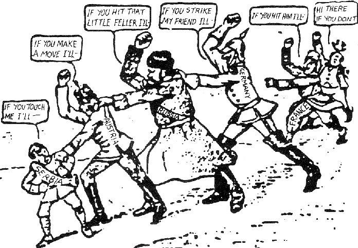
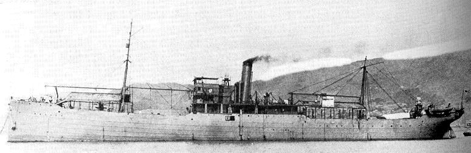
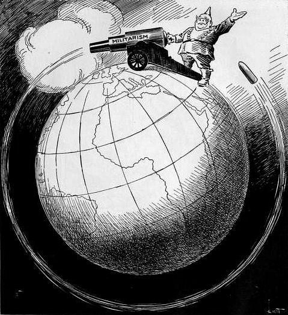

### Keywords
`21 Demands`, `Siege of Qingdao`, `Nishihara loans`, `China policy`

### Points of discussion

### Readings
Note: compulsory readings have been marked in **bold**

* **Gowen, Robert Joseph. 1971. “Great Britain and the Twenty-One Demands of 1915: Cooperation versus Effacement.” *The Journal of Modern History* 43 (1): 76–106. https://doi.org/10.1086/240589.**
* Melzer, Juergen. n.d. “Warfare 1914-1918 (Japan) | International Encyclopedia of the First World War (WW1).” Accessed November 16, 2018. https://encyclopedia.1914-1918-online.net/article/warfare_1914-1918_japan.
* **Schiltz, Michael. 2012. The Money Doctors from Japan: Finance, Imperialism, and the Building of the Yen Bloc, 1895-1937. Harvard University Asia Center.** Chapter 3 "Separating the Roots of the Chrysanthemum". [Here](https://drive.google.com/file/d/0B3cHT3HtkF5kNTRJM25ua29QcjA/view?usp=sharing) is a link to the whole manuscript.

### Primary sources

### Audiovisual materials

### Links to other projects, websites, others

### to follow (@twitter)

