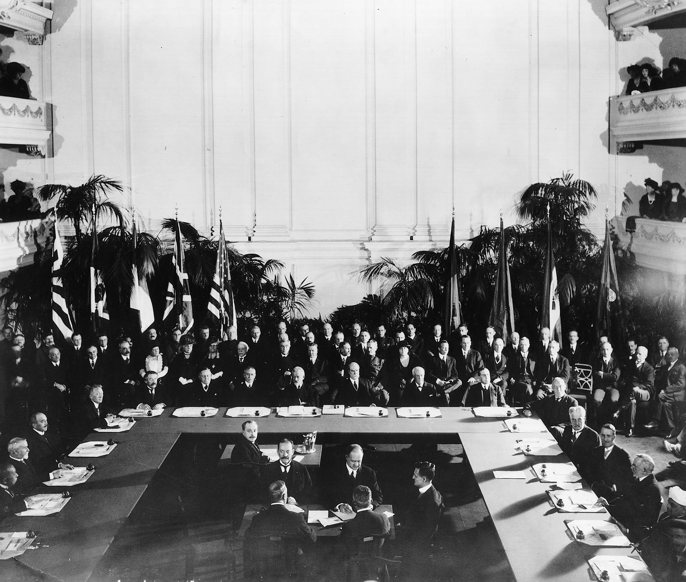

Source: author unknown. 2015. Հայերեն: Վաշինգտոնի Համաձայնագիր. blogs.baruch.cuny.edu/his1005spring2011/tag/five-power-naval-limitation-treaty/. https://commons.wikimedia.org/wiki/File:Washington_Naval_Treaty.jpg.

### Keywords

### Points of discussion

### Readings
Note: compulsory readings have been marked in **bold**

* **Ono, Keishi. 2015. “The Siberian Intervention and Japanese Society.” In *Japan and the Great War*, edited by Oliviero Frattolillo and Antony Best, 93–115. London: Palgrave Macmillan UK. https://doi.org/10.1057/9781137546746_6.**
Aftermath:
* **Asada, Sadao. 1993. “From Washington to London: The Imperial Japanese Navy and the Politics of Naval Limitation, 1921–1930.” *Diplomacy & Statecraft* 4 (3): 147–91. https://doi.org/10.1080/09592299308405899.**

### Primary sources

### Audiovisual materials

* The History Guy: History Deserves to Be Remembered. n.d. *Treaties and War, The Washington Naval Conference*. Accessed December 11, 2018. https://www.youtube.com/watch?v=w2F_PmoEIzY.

### Links to other projects, websites, others

### to follow (@twitter)

