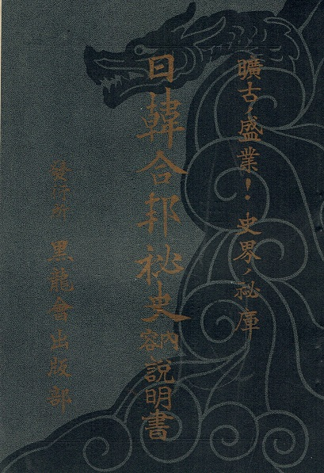

### Keywords

* `history of ideas`, `the white man's burden versus the yellow man's burden`, `imperialism`

### Points of discussion

* Pan-Asianism must be studied in its close relationship with what preceded it, namely Western imperialism. Discuss.
* In the late twentieth century, pan-Asianism may have been revived in the cloak of so-called 'Asian values'. Do you believe this comparison is warranted? If yes, discuss; if no, discuss.
* To what degree do you think pan-Asianism was mainstream rather than a fringe movement?

### Readings
Note: compulsory readings have been marked in **bold**

* **Iida, Yumiko. 1997. “Fleeing the West, Making Asia Home: Transpositions of Otherness in Japanese Pan-Asianism, 1905–1930.” *Alternatives* 22 (3): 409–32. https://doi.org/10.1177/030437549702200306**.
* **Saaler, Sven. 2014. “THE KOKURYŪKAI (BLACK DRAGON SOCIETY) AND THE RISE OF NATIONALISM, PAN-ASIANISM, AND MILITARISM IN JAPAN, 1901–1925.” *International Journal of Asian Studies* 11 (2): 125–60. https://doi.org/10.1017/S147959141400014X.**
* Wendelken, Cherie. 2000. “Pan-Asianism and the Pure Japanese Thing: Japanese Identity and Architecture in the Late 1930s.” *Positions: Asia Critique* 8 (3): 819–28. https://doi.org/10.1215/10679847-8-3-819.

### Primary sources

* **[Historical Documents Relating to the History of the Kokuryukai](http://www.japanesehistory.de/kokuryukai/)**

### Audiovisual materials

* wikipedia tts. n.d. Pan-Asianism | Wikipedia Audio Article. Accessed December 20, 2018. https://www.youtube.com/watch?v=yLclTHKltr8.

### Links to other projects, websites, others

* “Pan-Asianism as an Ideal of Asian Identity and Solidarity, 1850–Present−−１８５０ | The Asia-Pacific Journal: Japan Focus.” n.d. Accessed September 21, 2018. https://apjjf.org/2011/9/17/Christopher-W.-A.-Szpilman/3519/article.html.

### to follow (@twitter)

