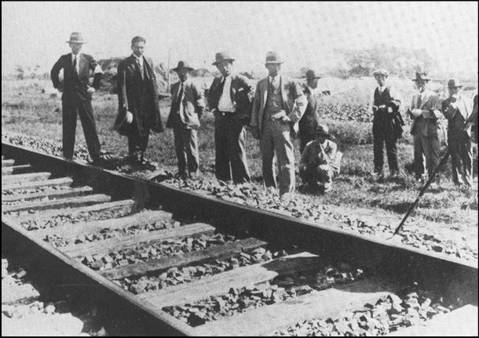

### Keywords

### Points of discussion

### Readings
Note: compulsory readings have been marked in **bold**

* **Robbins, Jane. 2001. “Presenting Japan: The Role of Overseas Broadcasting by Japan during the Manchurian Incident, 1931–7.” *Japan Forum* 13 (1): 41–54. https://doi.org/10.1080/09555800020027656**.
* **Tetsuya, Sakai. 2008. “The Political Discourse of International Order in Modern Japan: 1868–1945.” *Japanese Journal of Political Science* 9 (2): 233–49. https://doi.org/10.1017/S1468109908003009**.

### Primary sources

* [full text of the Lytton report](https://www.wdl.org/en/item/11601/view/1/1/) (Source: Library of Congress ['World Digital Library'](https://www.wdl.org/en/))
* Tchou, M. Thomas. 1932. *The Report of the Lytton Commission*. New York : China Institute in America. http://archive.org/details/lyttoncommission00tcho.

### Audiovisual materials

* “ Japan Walks Out Of Geneva Assembly - YouTube.” n.d. Accessed September 24, 2018. https://www.youtube.com/watch?v=hStmrz3N46U.

### Links to other projects, websites, others

### to follow (@twitter)

