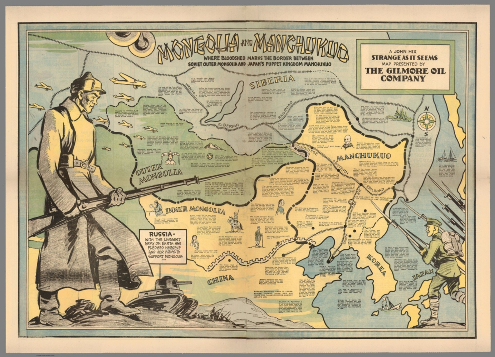

### Keywords

### Points of discussion

### Readings
Note: compulsory readings have been marked in **bold**

* Wilson, Sandra. 1995. “The ‘New Paradise’: Japanese Emigration to Manchuria in the 1930s and 1940s.” *The International History Review* 17 (2): 249–86. https://doi.org/10.1080/07075332.1995.9640708.
* Tamanoi, Mariko Asano. 2000. “Knowledge, Power, and Racial Classifications: The ‘Japanese’ in ‘Manchuria.’” *The Journal of Asian Studies* 59 (2): 248–76. https://doi.org/10.2307/2658656.
* Bremen, Jan van, and Akitoshi Shimizu. 1999. *Anthropology and Colonialism in Asia and Oceania*. Psychology Press.

### Primary sources

### Audiovisual materials

### Links to other projects, websites, others

### to follow (@twitter)

Source: David Rumsey Historical Map Collection
